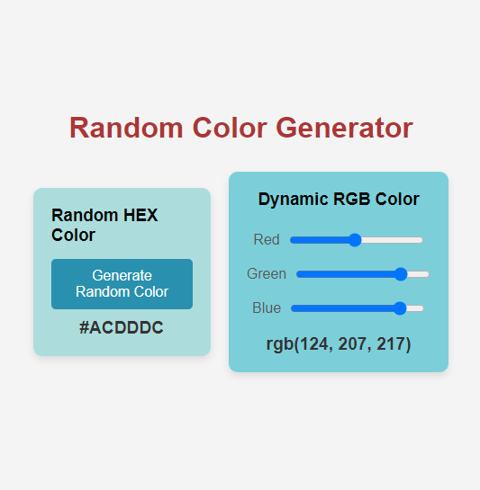

# 🎨 Random Color Generator

This project is a **Random Color Generator** that allows users to generate random colors in both **HEX** and **RGB** formats. Users can interactively adjust RGB values using sliders, generate a random HEX color, and copy color codes with a simple click.


## 🌟 Features
- Generate random colors in HEX format.
- Adjust RGB values dynamically using sliders.
- Convert HEX to RGB and RGB to HEX.
- User-friendly and responsive interface.
- Easily copy HEX and RGB color codes to the clipboard.


## 🚀 How It Works
The **Random Color Generator** consists of two main components: **HEX color generation** and **RGB color adjustment**.

### Color Conversion Logic
1. **Generating Random HEX Colors**:
   - A random HEX color code is created using the characters `0-9` and `A-F`. The code generates a six-character color code like `#FF5733`.

2. **Converting HEX to RGB**:
   - The HEX code is split into three components: `Red`, `Green`, and `Blue`. Each value is converted from HEX to decimal using:
     ```javascript
     const r = parseInt(hexColor.slice(1, 3), 16);
     const g = parseInt(hexColor.slice(3, 5), 16);
     const b = parseInt(hexColor.slice(5, 7), 16);
     ```
   - The resulting RGB format is displayed as `rgb(255, 87, 51)`.

3. **Converting RGB to HEX**:
   - The RGB values are converted back to a HEX format using the following logic:
     ```javascript
     function rgbToHex(r, g, b) {
       const toHex = (c) => c.toString(16).padStart(2, '0').toUpperCase();
       return `#${toHex(r)}${toHex(g)}${toHex(b)}`;
     }
     ```
   - This function receives red, green, and blue values as input and returns the corresponding HEX color code.

4. **Dynamic RGB Adjustment**:
   - Users can adjust RGB values via sliders, with the UI updating instantly to reflect the changes.

## 🎨 UI Details
The UI is designed for simplicity and responsiveness:
- **HEX Color Section**: Users can generate a random color by clicking a button, updating both the background color and the HEX code.
- **RGB Color Section**: Sliders for **Red**, **Green**, and **Blue** allow users to fine-tune the color, with immediate updates to the RGB display.
- **Copy Functionality**: Clicking on the displayed color codes copies them to the clipboard, making it easy to use the generated colors.

### Screenshot
 

## 🛠️ Technologies Used
- HTML
- CSS
- JavaScript

## 📥 Getting Started
To get a local copy of this project up and running, follow these steps:

1. **Clone the repository**:
   ```bash
   git clone https://github.com/yourusername/random-color-generator.git
